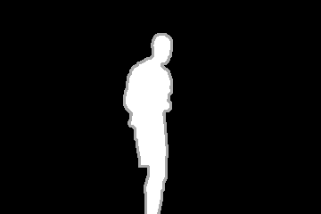
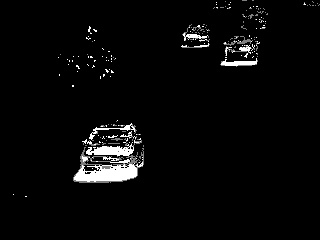

# Background subtraction

Two methods for background subtraction, respectively frame differencing and median filtering has been
evaluated for highway, office and pedestrians scenes from the http://www.changedetection.net/ \
Datasets are found under Dataset &gt;2012&gt; Baseline category.

## Frame differencing
In this approach, the first frame from the sequence is taken as the basis and the remaining one are compared with it. After the differencing, a threshold is applied to it. First the threshold was set as 25 however, 50 gave a better performance. Finally, a gaussian blur was used both on the first frame and the rest to remove part of the noise.

Figure 1 On the left: ground truth for office frame 726, On the right the same frame from the frame differencing results.

## Median filtering:
This method takes advantage of the frame history. History and varThreshold (to decide whether a pixel is well described by the background model.) can be adjusted with the OpenCV built-in createBackgroundSubtractorMOG2() The advantage of this approach is that it can handle background changes such as sunrise, sunset etc. 

Figure 2 On the left: ground truth for highway frame 999, On the right the same frame from the frame median filtering results.

## Results:

| Method/Scene       | Highway | Office | Pedestrians |
| ------------------:| -------:| ------:| -----------:|
| Frame differencing | 58%     | 80%    | 63%         |
| Median filtering   | 65%     | 86%    | 46%         |

Accuracies are calculated by taking the absolute difference of results found and ground truths and dividing them by the ground thruth over each frame. Nan and infinite values are removed from the results and their means are taken. As it can be seen above, median filtering gives a better result for the first two scenes. 
 
In the office environment motion detection and background subtraction was done effectively. The parameters tried to upgrade pedestrian scene results downgraded other results, so it was left as it is. In median filtering a short history parameter performed better compared to the longer ones such as 500. Overall, these results are satisfactory considering the subtracted elements from the videos are clearly identifiable and can be used for detection or other purposes.
